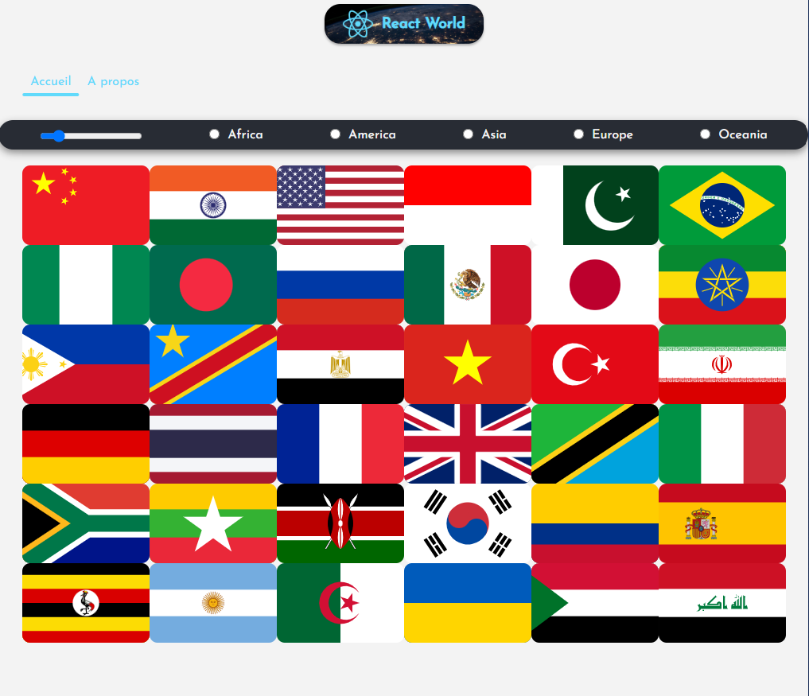

# CountriesAppReact

Application pour afficher les pays du monde en utilisant REACT et axios pour la requête API. Il y a un système de filtre par région et de nombre afficher.
Enfin un blog afin de poster des articles stocker dans une base de données noSQL afin de gerer un CURD.

## Technologies utilisées

- React
- Axios
- SCSS
- Node.js
- NPM
- noSQL
- API REST
- JSON Server
